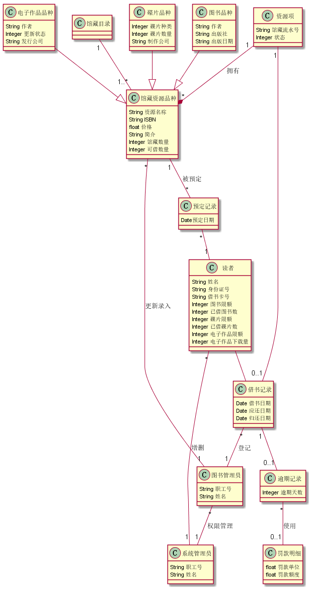

|学号|班级|姓名|照片|
|:-------:|:-------------: | :----------:|:---:|
|201510414325|软工三班|张文|

# 1. 图书管理系统的类图

## 1.1. 类图PlantUML源码如下
<pre>
@startuml
class 馆藏目录
class 馆藏资源品种 {
    String 资源名称
    String ISBN
    float 价格
    String 简介
    Integer 馆藏数量
    Integer 可借数量
}
class 碟片品种 {
    Integer 碟片种类
    Integer 碟片数量
    String 制作公司
}
class 图书品种 {
    String 作者
    String 出版社
    String 出版日期
}
class 电子作品品种 {
    String 作者
    Integer 更新状态
    String 发行公司
}
class 资源项 {
    String 馆藏流水号
    Integer 状态
}
class 借书记录{
    Date 借书日期
    Date 应还日期
    Date 归还日期
}
class 图书管理员{
    String 职工号
    String 姓名
}
class 逾期记录{
    Integer 逾期天数
}
class 罚款明细{
    float 罚款单位
    float 罚款额度
}
class 读者{
    String 姓名
    String 身份证号
    String 借书卡号
    Integer 图书限额
    Integer 已借图书数
    Integer 碟片限额
    Integer 已借碟片数
    Integer 电子作品限额
    Integer 电子作品下载量
}
class 预定记录{
    Date预定日期
}
class 系统管理员{
    String 职工号
    String 姓名
}
馆藏目录 "1"--"1..*" 馆藏资源品种
碟片品种 --|> 馆藏资源品种
图书品种 --|> 馆藏资源品种
电子作品品种 --|> 馆藏资源品种
资源项"1" --* "*" 馆藏资源品种 :拥有
资源项 "1"--"0..1" 借书记录
借书记录 "*"--"1" 图书管理员:登记
借书记录"1"--"0..1"逾期记录
逾期记录"*"--"0..1"罚款明细:使用
读者--借书记录
馆藏资源品种"1"--"*"预定记录:被预定
预定记录"*"--"1"读者
读者"*"--"1"系统管理员:增删
图书管理员"*"--"1"系统管理员:权限管理
馆藏资源品种"*"--"1"图书管理员:更新录入
@enduml
</pre>

## 1.2. 类图如下

## 1.3. 类图说明
该类图由“读者”，“图书管理员”，“系统管理员”，“图书”，“碟片”等实体类构成，之间由聚集，组合等关系相关联，类图中是该类的各种属性

# 2. 图书管理系统的对象图

## 2.1. 类"馆藏目录"的对象图
源码如下
<pre>
@startuml
Object 馆藏目录
@enduml
</pre>

对象图如下

## 2.2. 类"馆藏资源品种"的对象图
源码如下
<pre>
@startuml
Object 馆藏资源目录
馆藏资源目录 : 资源名称 = 小猪佩奇
馆藏资源目录 : 国际出版号 = 9787539788852
馆藏资源目录 : 价格 = ￥87.60
馆藏资源目录 : 简介 = 小猪佩奇动画片风靡全球，第一辑图画书上市以来已销售117万册
馆藏资源目录 : 馆藏数量 = 10000
馆藏资源目录 : 可借数量 = 0
@enduml
</pre>

对象图如下

## 2.3. 类"图书品种"的对象图
源码如下
<pre>
@startuml
Object 图书品种
图书品种 : 作者 = 英国快乐瓢虫出版公司著
图书品种 : 出版社 = 安徽少年儿童出版社
图书品种 : 出版日期 = 2016-5
@enduml
</pre>

对象图如下

## 2.4. 类"碟片品种"的对象图
源码如下
<pre>
@startuml
Object 碟片品种
碟片品种 : 作者 = 阿斯特利贝加戴维斯
碟片品种 : 碟片数 = 10000
碟片品种 : 制作公司 = E1 Kids
@enduml
</pre>

对象图如下

## 2.5. 类"电子作品品种"的对象图
源码如下
<pre>
@startuml
Object 电子作品品种
电子作品品种 : 作者 = 阿斯特利贝加戴维斯
电子作品品种 : 更新状态 = 已完结
电子作品品种 : 发行公司 = E1 Kids
@enduml
</pre>

对象图如下

## 2.6. 类"读者"的对象图
源码如下
<pre>
@startuml
object 读者
读者 : 姓名 = "张三"
读者 : 身份证号 = 513030**********
读者 : 借书卡号 = 123456
读者 : 图书限额 = 5
读者 : 已借图书数 = 3
读者 : 碟片限额 = 5
读者 : 已借碟片数 = 3
读者 : 电子作品限额 = 100
读者 : 下载数 = 10
@enduml
</pre>

对象图如下

## 2.7. 类"图书管理员"的对象图
源码如下
<pre>
@startuml
Object 图书管理员
图书管理员 : 职工号 = 123456
图书管理员 : 姓名 = 王五
@enduml
</pre>

对象图如下

## 2.8. 类"系统管理员"的对象图
源码如下
<pre>
@startuml
Object 系统管理员
系统管理员 : 职工号 = 223456
系统管理员 : 姓名 = 李四
@enduml
</pre>

对象图如下

## 2.9. 类"资源项"的对象图
源码如下
<pre>
@startuml
Object 资源项
资源项 : 馆藏流水号 = 201103001
资源项 : 状态 = 借出
@enduml
</pre>

对象图如下

## 2.10. 类"借书记录"的对象图
源码如下
<pre>
@startuml
Object 借书记录
借书记录 : 借书日期 = 2015-06-05
借书记录 : 应还日期 = 2015-06-12
借书记录 : 归还日期 = 2018-02-02
@enduml
</pre>

对象图如下

## 2.11. 类"逾期记录"的对象图
源码如下
<pre>
@startuml
Object 逾期记录
逾期记录 : 逾期天数 = 12
@enduml
</pre>

对象图如下

## 2.12. 类"预定记录"的对象图
源码如下
<pre>
@startuml
Object 预定记录
预定记录 : 预定日期 = 2018-04-20
@enduml
</pre>

对象图如下

## 2.13. 类"罚款明细"的对象图
源码如下
<pre>
@startuml
Object 罚款明细
罚款明细 : 罚款单位 = 10/天
罚款明细 : 罚款额度 = 100
@enduml
</pre>

对象图如下

