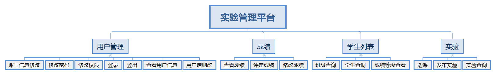

# 基于GitHub的实验管理平台分析与设计

|学号|班级|姓名|照片|
|:-------:|:-------------: | :----------:|:---:|
|201510414325|软工三班|张文|

## 1.概述
- 基于GitHub的实验管理平台的作用是在线管理实验成绩的Web应用系统。学生和老师的实验内容均存放在GitHUB
页面上。
- 学生的功能主要有：一是设置自己的GitHub用户名，二是查询自己的实验成绩。学生的GitHub用户名是公开的，但成绩不公开，三是选择课程。
- 老师的功能主要有：一是批改每个学生的成绩，二是查看每个学生的成绩，三是发布实验，四是选择课程。
- 老师和学生都能通过本系统的链接方便地跳转到学生的每个GitHUB实验目录，以便批改实验或者查看实验情况。
- 实验成绩按数字分数计算，每项实验的满分为100分，最低为0分。
- 系统自动计算每个学生的所有实验的平均分。

## 2.系统总体结构

界面设计详见：https://github.com/Anntly/is_analysis/tree/master/test6/demo/login.html

## 3. 用例图设计 [源码](用例图设计.puml)

## 4.类图设计 [源码](类图.puml)

## 5.数据可设计
* [参见数据库设计](数据库设计.md)

## 6.用例及界面详细设计
* [学生列表用例](用例/学生列表用例.md)（界面详见用例）
* [查看成绩用例](用例/查看成绩用例.md)
* [查看实验用例](用例/查看实验用例.md)
* [查看用户信息用例](用例/查看用户信息用例.md)
* [登出用例](用例/登出用例.md)
* [登录用例](用例/登录用例.md)
* [发布实验用例](用例/发布实验用例.md)
* [评定成绩用例](用例/评定成绩用例.md)
* [删除用户用例](用例/删除用户用例.md)
* [添加用户用例](用例/添加用户用例.md)
* [修改密码用例](用例/修改密码用例.md)
* [修改用户信息用例](用例/修改用户信息用例.md)
* [修改用户用例](用例/修改用户用例.md)
* [选择课程用例](用例/选择课程用例.md)
* [用户列表实例](用例/用户列表实例.md)
