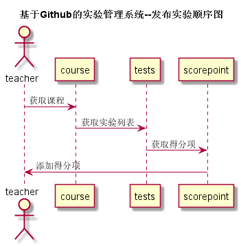

## 添加得分项用例 [返回](../README.MD)

### 1.用例规约

<table>
      <tr>
			   <th>用例名称</th>
			   <th>添加得分项</th>
      </tr>
      <tr>
			   <th>参与者</th>
			   <th>老师</th>
      </tr>
      <tr>
			   <th>前置条件</th>
			   <th>执行登陆操作</th>
      </tr>
      <tr>
			   <th>后置条件</th>
			   <th></th>
      </tr>
      <tr>
			   <th colspan="2">主事件流</th>
      </tr>
      <tr>

      </tr>
      <tr>
			   <th colspan="2">备选事件流</th>
      </tr>
</table>

### 2.业务流程(顺序图) [源码](../添加得分项顺序图.puml)

### 3.界面设计
* 界面参照：https://anntly.github.io/is_analysis/test6/demo/addpoint.html
* API接口调用
  * 接口1: [setScorePoint](../接口/setScorePoint.md)

### 4.算法描述
  无

### 5.参照表
* [STUDENTS](../数据库设计.md/#STUDENTS)
* [GRADES](../数据库设计.md/#GRADES)
* [TESTS](../数据库设计.md/#TESTS)
* [TERMS](../数据库设计.md/#TERMS)
* [SCORE_POINT](../数据库设计.md/#SCORE_POINT)
