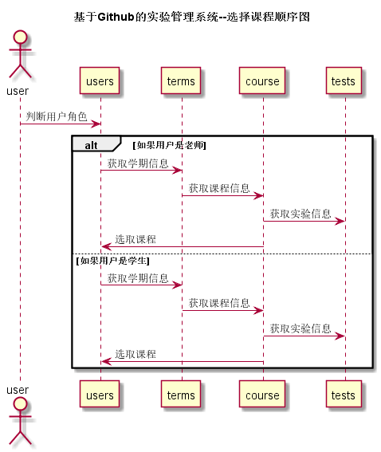

## 学生列表用例 [返回](../README.MD)

### 1.用例规约

<table>
      <tr>
			   <th>用例名称</th>
			   <th>学生列表</th>
      </tr>
      <tr>
			   <th>参与者</th>
			   <th>学生，老师</th>
      </tr>
      <tr>
			   <th>前置条件</th>
			   <th>执行登陆操作</th>
      </tr>
      <tr>
			   <th>后置条件</th>
			   <th></th>
      </tr>
      <tr>
			   <th>主事件流</th>
         <th>1.对年级，班级，课程进行选择 
              2.提交表单
         </th>
      </tr>
      <tr>

      </tr>
      <tr>
			   <th>备选事件流</th>
         <th>1a,有选项为空 1.提醒输入内容</th>
      </tr>
</table>

### 2.业务流程(顺序图) [源码](../选择课程顺序图.puml)

### 3.界面设计
* 界面参照:https://anntly.github.io/is_analysis/test6/demo/courseselect.html
   https://anntly.github.io/is_analysis/test6/demo/courseselect_teacher.html
* API接口调用
  * 接口1:[setCourse](../接口/setCourse.md)
  用于提交选课信息

## 4.算法描述
无
## 5. 参照表
* [USERS](../数据库设计.md/#USERS)
* [TERMS](../数据库设计.md/#TERMS)
* [TESTS](../数据库设计.md/#TESTS)
* [COURSE](../数据库设计.md/#COURSE)
